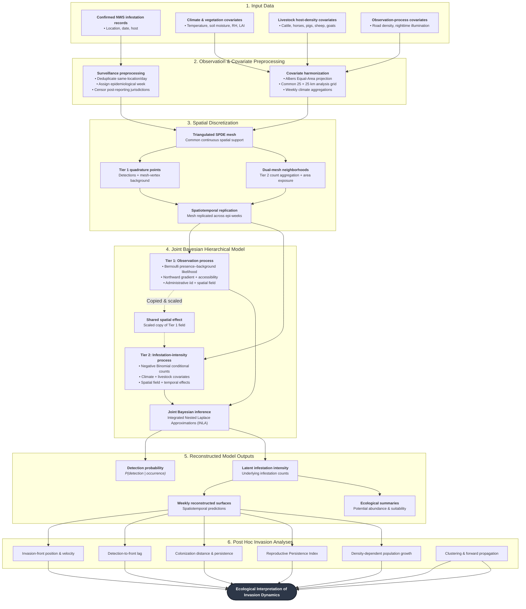

## Details

1. **Input data.** The analysis integrates confirmed NWS infestation detections with environmental, host-density, and observation-process covariates[cite: 1]. Surveillance records provide the response data, whereas climate, vegetation, livestock density, road density, and nighttime illumination provide predictors for the ecological and observation components of the model[cite: 1].
2. **Observation and covariate preprocessing.** Duplicate surveillance records occurring at the same geographic location on the same day are removed, and detections are assigned to epidemiological weeks[cite: 1]. Locations are not spatially thinned[cite: 1]. Spatial covariates are transformed to an Albers Equal-Area coordinate reference system and harmonized to a common 25 × 25 km analysis grid; temporally varying environmental covariates are summarized to weekly values[cite: 1].
3. **Spatial discretization.** A triangulated SPDE mesh defines the common spatial support for the hierarchical model[cite: 1]. Mesh vertices serve as integration or background locations for the Tier 1 presence–background likelihood, while the corresponding dual-mesh natural neighborhoods define the spatial units used to aggregate counts and calculate geographic exposure in Tier 2[cite: 1]. The spatial support is replicated through epidemiological time[cite: 1].
4. **Joint Bayesian hierarchical model.** Tier 1 represents the observation process and estimates the probability that an infestation is detected and reported[cite: 1]. Tier 2 represents latent infestation intensity and models counts conditional on detection[cite: 1]. Separate spatial and temporal effects are estimated for the two processes, while a scaled copy of the Tier 1 spatial field is included in Tier 2 to account for spatial structure associated with surveillance[cite: 1].
5. **Reconstructed model outputs.** Joint model fitting produces estimates of detection probability and latent infestation intensity through space and time[cite: 1]. These estimates are projected to weekly spatial surfaces and form the basis for subsequent estimates of potential abundance and reproductive persistence[cite: 1].
6. **Post hoc invasion analyses.** Weekly reconstructed surfaces are used to quantify invasion-front position and velocity, lag between reported detections and the estimated front, colonization distance and persistence, the Reproductive Persistence Index, density-dependent population growth, and the relationship between local clustering and subsequent forward propagation[cite: 1].